# Dom Manipulation Assignment

1. Website Name: [Dev To](https://dev.to/)

### Topics

    - Query Selctory, Inner HTML

### Sample Image


### Tasks

        Target the Top description div and change the DEV Community to <Your_Name> and description to your passion

### Code (Answer)

```javascript
const title = document.querySelector(".crayons-subtitle-2");
title.innerHTML = "Vidya Sagar";
```

### Output

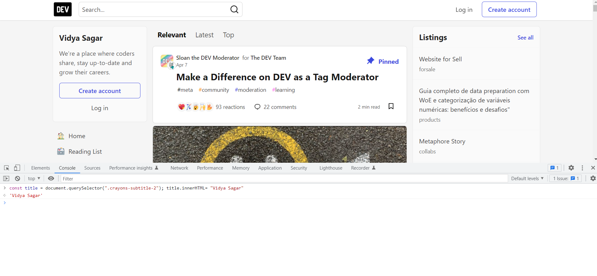

2. Website Name: [Apple](https://support.apple.com/en-in)

### Task


### Fetch all the product name and store in an array

### Code (Answer)

```javascript
const arr1 = [];
document
  .querySelectorAll(
    ".as-imagegrid-wrapper.row.as-imagegrid--7up.as-imagegrid--base"
  )
  .forEach((item) => {
    arr1.push(item.innerText.replace("\n", ""));
  });
console.log(arr1);
```
 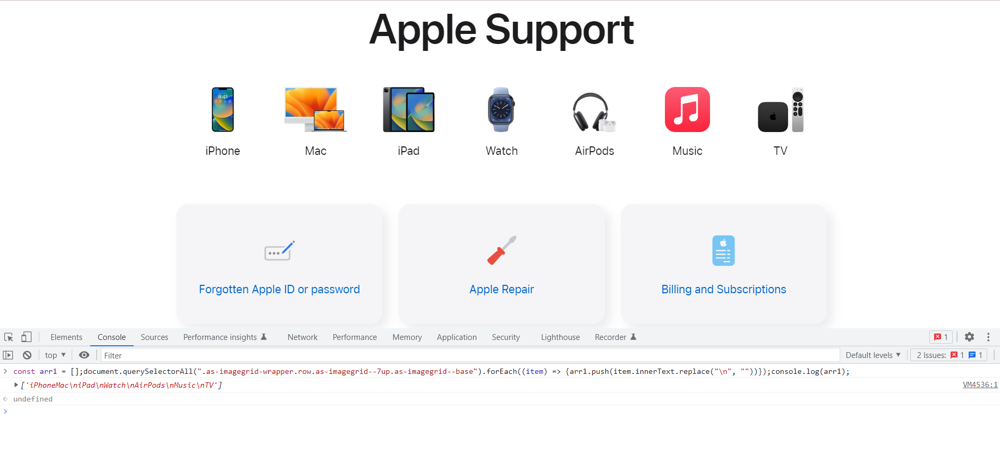

### Output

['iPhone', 'Mac', 'iPad', 'Watch', 'AirPods', 'Music', 'TV']

3. Webiste Name: [Youtube Support](https://support.google.com/youtube/)

### Topics

    - Get Element By Id, Create Element, Create Text Node, Append Child

### Sample Image


### Tasks

     Add another FAQ 'My New FAQ' to the list

### Code (Answer)

```javascript
const list = document.querySelector(".parent");
const text = document.createElement("h3");
list.append(text);
text.innerText = "My New FAQ";
```

### Output

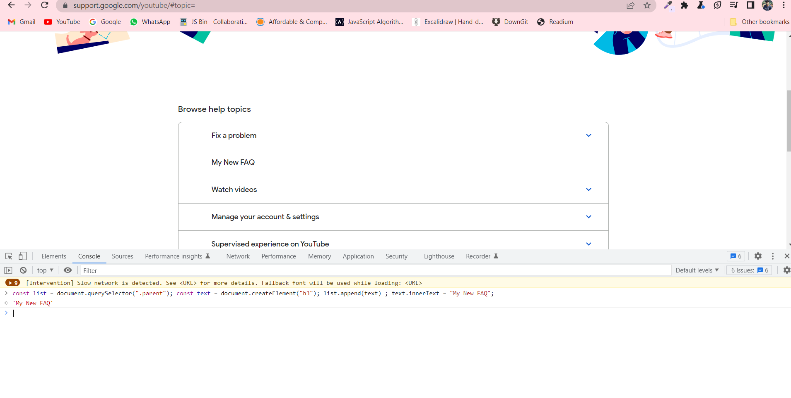

4. Webiste Name: [OnePlus](https://www.oneplus.in/support)

### Topics

     Query Selector, InnerText

### Sample Image


### Tasks

      Change the contact number

### Code (Answer)

```javascript
const newNumber = document.getElementsByClassName("item--subtitle");
newNumber[0].innerText = "1800 123 123";
```

### Output

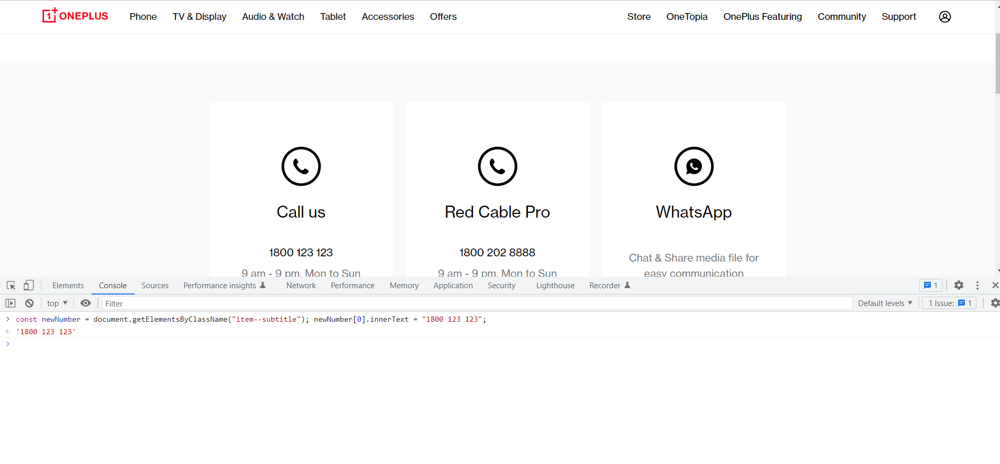

5. Webiste Name: [Samsung](https://www.samsung.com/in/offer/online/samsung-fest/)

### Topics

       getElementById, createElement, InnerText, append, setAttribute

### Sample Image


### Tasks

     Target the main div of card and change the Button text to Check out

### Code (Answer)

```javascript
const btn = document.querySelectorAll(".button-collection"); 
for(i=0;i<btn.length-1;i++){btn[i].innerText= "Checkout"};
```

### Output

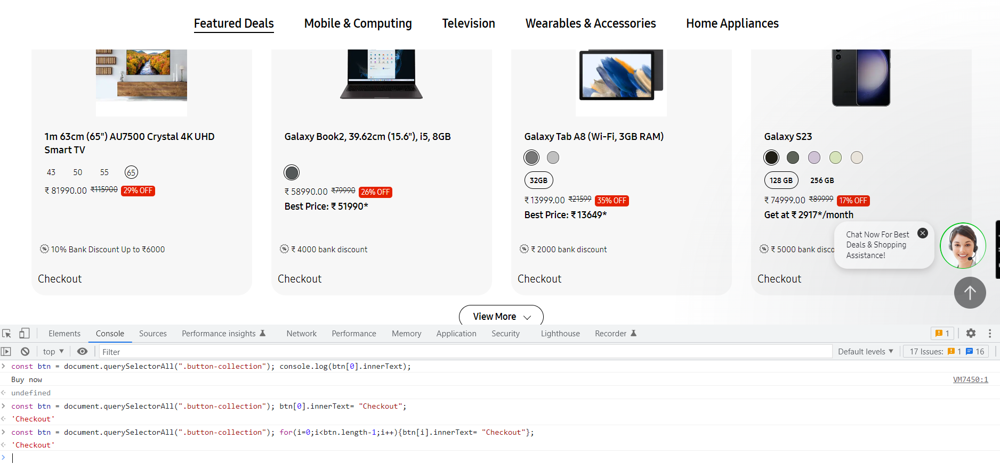

6. Webiste Name: [Adidas](https://www.adidas.co.in/)

### Topics

    -   Query Selector, Event listeners, Changing Styles

### Sample Image


### Tasks

     Target the search box and on hover change thebackground color to red.

### Code (Answer)

```javascript
let searchbox = document.querySelector("._input_1f3oz_13");
searchbox.addEventListener("mouseover", (e) => {
  searchbox.style.backgroundColor = "red";
});
```

### Output

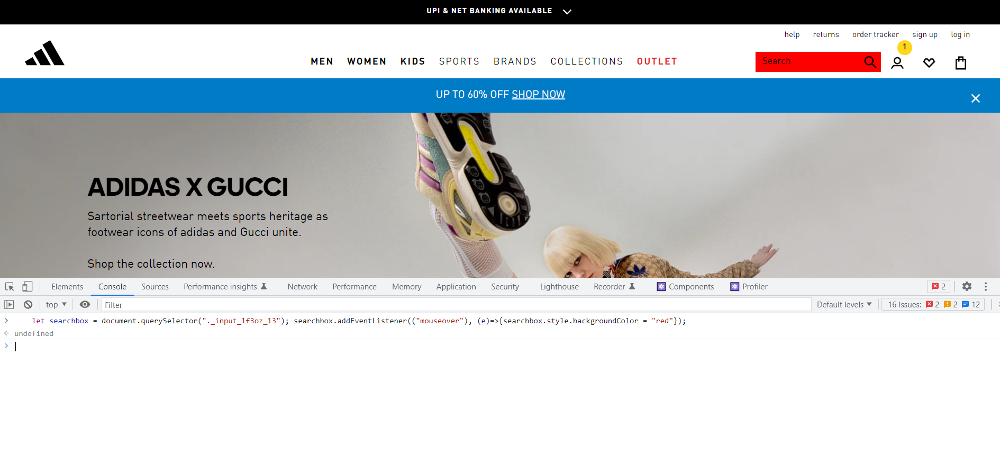

7. Website Name: [MDN Web Docs](https://developer.mozilla.org/en-US/)

### Topics

       Form, Value, Submit

### Sample Image


### Tasks

     To Search a topic in the MDN Search bar.
     First add a text to search in the search bar and then hit the submit search button to search the docs using DOM

### Code (Answer)

```javascript
document.getElementById("hp-search-input").value = "DOM";
document.getElementById("hp-search-form").submit();
```

### Output

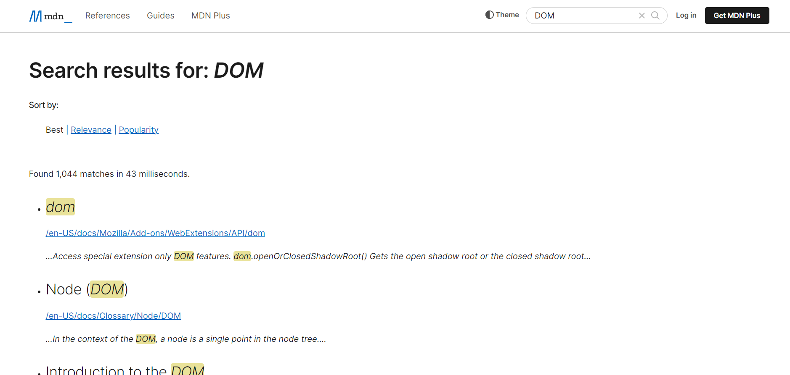

8. Webiste Name: [Google](https://www.google.com/)

### Topics

       Remove Elements

### Sample Image


### Tasks

     Remove alternate languages from the home page languages listed

### Code (Answer)

```javascript
const language = document.getElementById("SIvCob").children;
for (let i = language.length - 1; i >= 0; i--) {
  if ([i] % 2 == 0) {
    language[i].remove();
  }
}
```

### Output

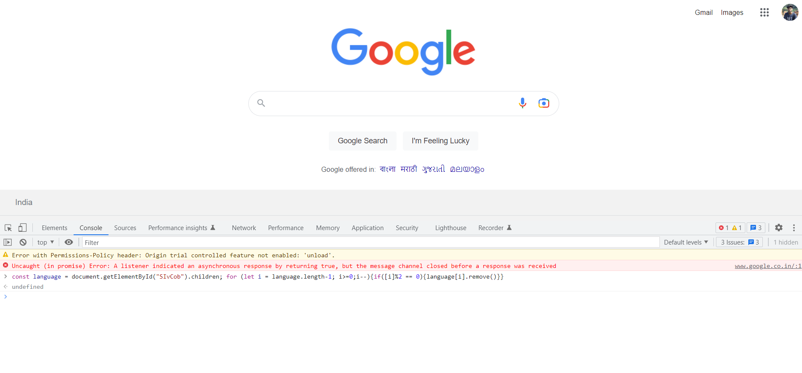

9. Webiste Name: [Code Wars](https://www.codewars.com/)

### Topics

       Change Font Family, Color of Text.

### Sample Image


### Tasks

    Change the font family of the text to monospace and text color to the logo’s background color.

### Code (Answer)

```javascript
const heading = document.getElementsByTagName("h1");
heading.style.fontFamily = "monospace";

const bgcolor = document.getElementsByTagName("h1");
heading.style.backgroundColor = "#1B1C1E";
```

### Output


10. Webiste Name: [Freecodecamp](https://www.freecodecamp.org/)

### Topics

       querySelector, mouseover, click eventListener,  callback function, style,

### Sample Image


### Tasks

    Target the button and change background colour on mouseover

### Code (Answer)

```javascript
const bgcolor = document.getElementsByClassName("login-btn-text");
bgcolor[0].addEventListener(
  "mouseover",
  (e) => (bgcolor[0].style.backgroundColor = "red")
);
```

### Output

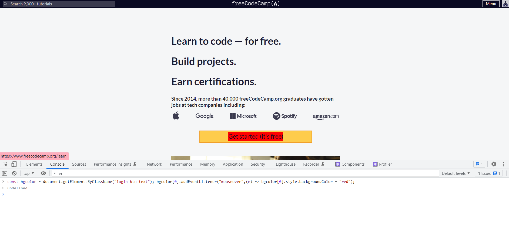

11. Webiste Name: [realme](https://www.realme.com/in/)

### Topics

       querySelector,style,background-image

### Sample Image


### Tasks

    change the realme logo to ineuron logo

### Code (Answer)

```javascript
const logo = document.getElementsByClassName("icon-logo");
logo.style.backgroundImage = "url("https://ineuron.ai/images/ineuron-logo.png")"
```

### Output


12. Webiste Name: [Github](https://github.com/)

### Topics

       querySelector,style,background-Color

### Sample Image


### Tasks

     change the background colour of the button to blue.

### Code (Answer)

```javascript
const btn = document.querySelectorAll(".btn.btn-sm.btn-primary");
btn[0].style.backgroundColor = "blue";
```

### Output

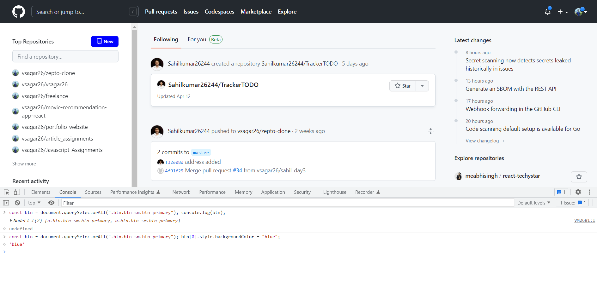

13. Webiste Name: [Hackerrank](https://www.hackerrank.com/)

### Topics

       querySelector,innerHtml

### Sample Image


### Tasks

Target the top description and change “Matching developers with great companies” to ‘JSBOOTCAMP“.

### Code (Answer)

```javascript
const text = document.getElementsByClassName("home22-intro-text");
text[0].innerText = "JSBOOTCAMP";
```

### Output

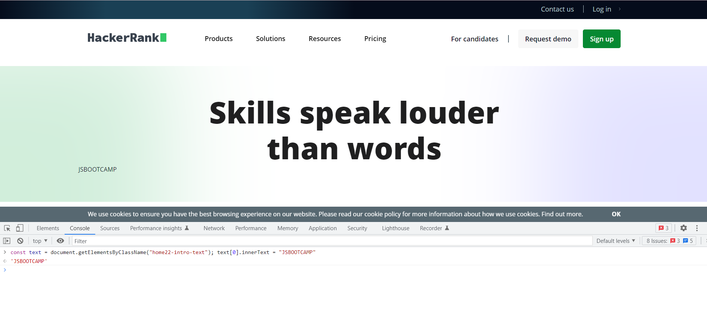

14. Webiste Name: [Asus](https://www.asus.com/in/)

### Topics

      querySelector,style,font-size

### Sample Image


### Tasks

       change the fontsize of “Hot Deals” to 80px

### Code (Answer)

```javascript
const text = document.querySelectorAll(".HotDealsAll__Heading__2fIbe");
text[0].style.fontSize = "80px";
```

### Output

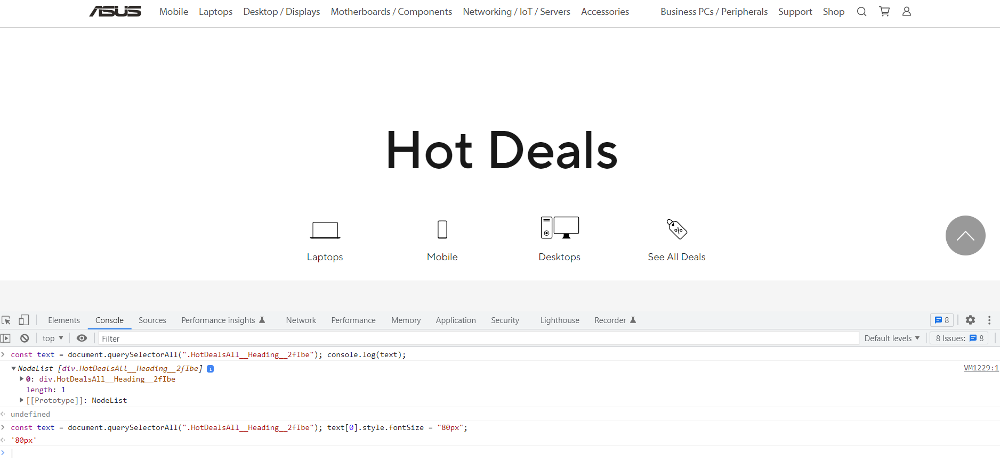

15. Webiste Name: [Dell](https://www.dell.com/en-in/shop/deals/laptop-deals?gacd=10415953-9016-5761040-285981356-0&dgc=ST&gclid=Cj0KCQjwguGYBhDRARIsAHgRm4-XUDMhhVNyHXb3s1gY4ZBzORr_d9Se-buhJwy7asyUe7YdqEA11eEaAt6UEALw_wcB&gclsrc=aw.ds&nclid=BxjBlpBQsX6pjSHh-L8YYSU77EpfXRkG1AGMB5Wbeu386ykspfrPDnfx_DdFau20)

### Topics

      querySelector,style.textAlign

### Sample Image


### Tasks

       Convert the text “G15 Gaming Laptop” from left to right

### Code (Answer)

```javascript
const title = document.querySelector(".ps-title");
title.style.textAlign = "right";
```

### Output

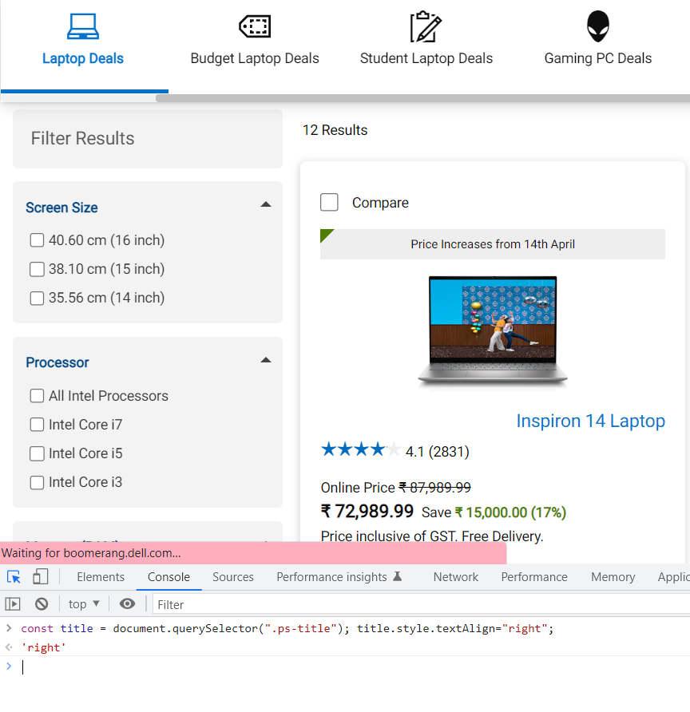

16. Webiste Name: [Vercel](https://vercel.com/)

### Topics

     querySelector,innerHTMl

### Sample Image


### Tasks

      change the heading “Start with the developer” to “Start with Scratch”

### Code (Answer)

```javascript
let text = document.querySelectorAll(".section-title_title__VEDfK");
text[0].innerText = "Start With Scratch";
```

### Output

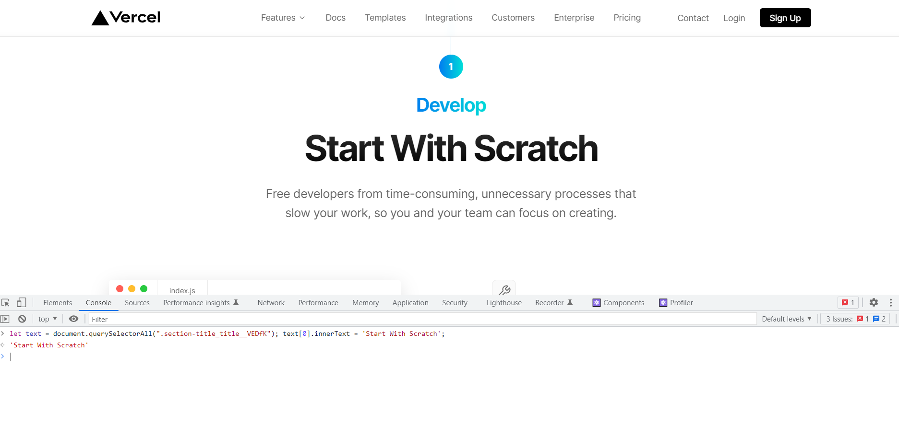

17. Webiste Name: [Sony](https://www.sony.co.in/)

### Topics

    querySelector,innerHTMl

### Sample Image

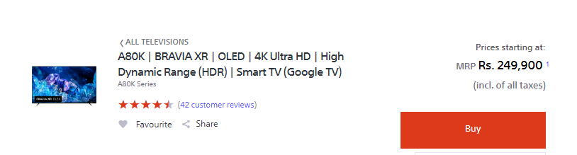

### Tasks

     change the button text To current Date.

### Code (Answer)

```javascript
const btn = document.querySelectorAll(".buy-btn");
btn.innerHTML = new Date();
```

### Output


18. Webiste Name: [Philips](https://www.philips.co.in/)

### Topics

     querySelector,style,backgroundcolor

### Sample Image


### Tasks

    change the background colour blue to orange

### Code (Answer)

```javascript
const footer = document.querySelectorAll(".p-layout-row.p-row-gutter");
footer[0].style.backgroundColor = "orange";
```

### Output

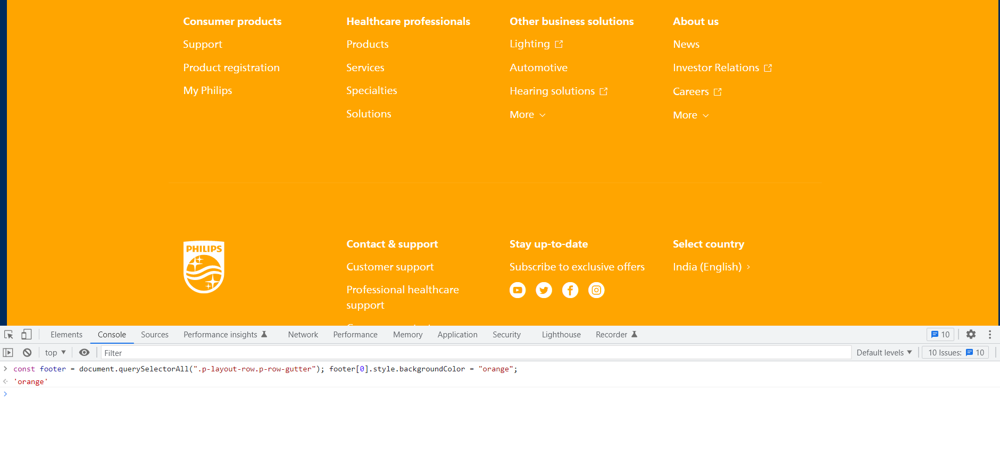

19. Webiste Name: [Canon](https://in.canon/)

### Topics

          querySelector,src

### Sample Image


### Tasks

    extract the canon logo

### Code (Answer)

```javascript
const logo = document.querySelectorAll(".logo");
console.log(logo[0].currentSrc);
```

### Output

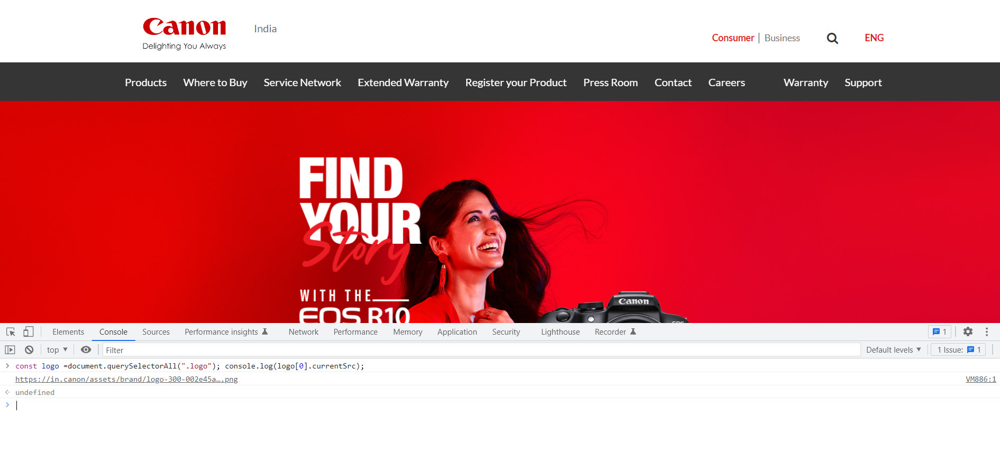

20. Webiste Name: [Oppo](https://www.oppo.com/in/)

### Topics

          querySelector,style,color

### Sample Image


### Tasks

      Change the description colour black to orange

### Code (Answer)

```javascript
const text = document.querySelectorAll(
  ".ft-body-2.homepage-featured-product-bottom-text"
);
text[1].style.color = "orange";
```

### Output

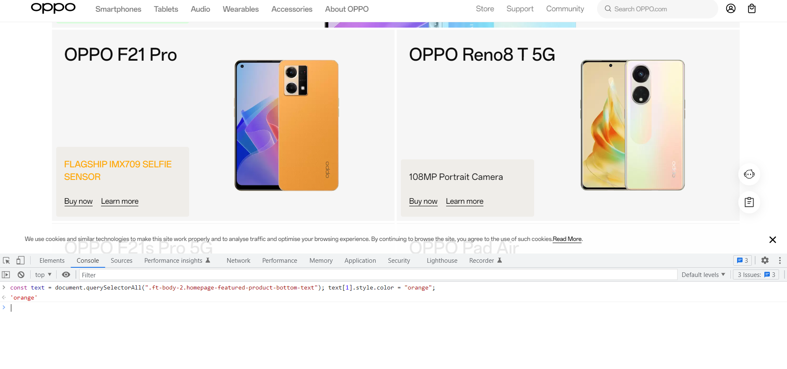
